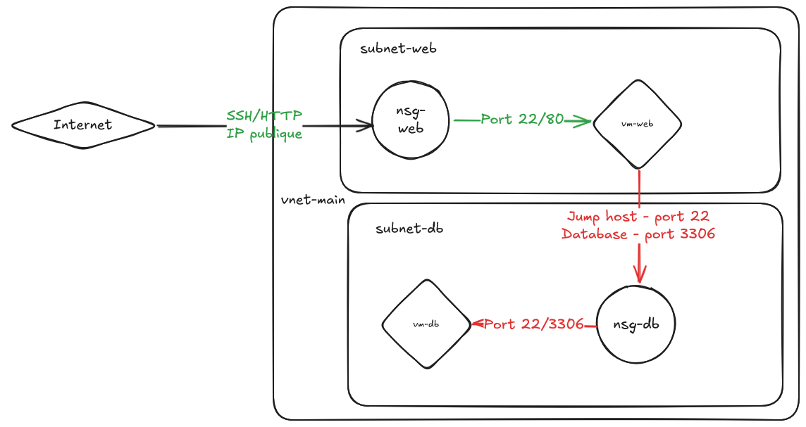
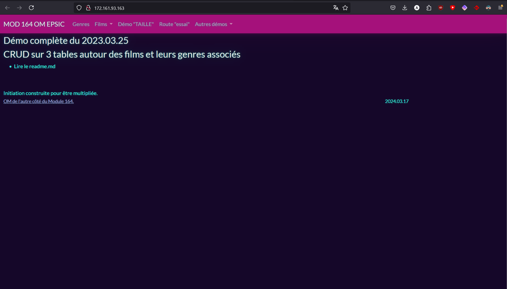
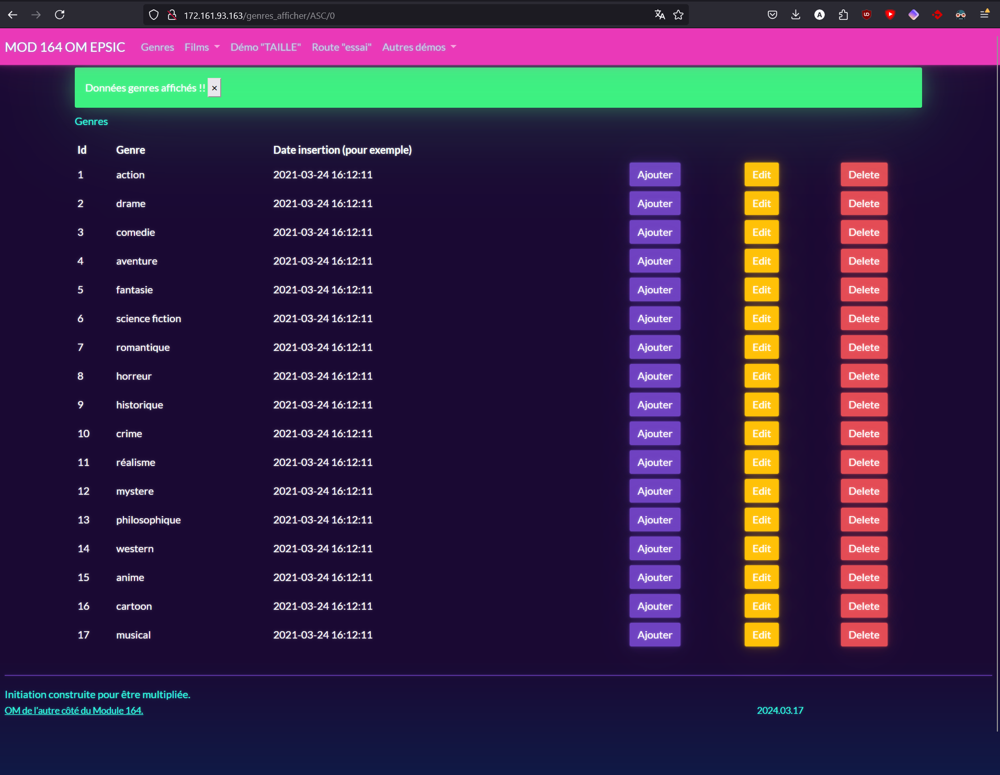

# Module 346 - Mise en place d'une application Flask

## Introduction

Ce document montre notre approche étape par étape pour préparer le déploiement de l'application Flask dans le Cloud.

Note : nous avons utilisé le CLI azure pour créer et paramétrer les instances Azure. Vous pouvez suivre [ce lien](https://learn.microsoft.com/en-us/cli/azure/get-started-with-azure-cli) pour télécharger et paramétrer celui-ci.

## Auteurs

Ce TP a été réalisé par Adrien Gunther et Thomas Burkhalter.

Le résultat final du TP est accessible à l'adresse `http://172.161.93.163`.

### Composants de l'architecture

- **Groupe de ressources**: `pc04sej` (pré créé)
- **Region**: `switzerlandnorth`
- **Machines virtuelles**:
  - `vm-web`: Machine virtuelle contenant l'application flask (IP publique)
  - `vm-db`: Serveur MariaDB (IP privée uniquement)
- **Composants réseaux**:
  - **Réseau virtuel**: `vnet-main` (10.10.0.0/16)
  - **Subnets**: `subnet-web` (10.10.1.0/24), `subnet-db` (10.10.2.0/24)
  - **NSGs**: `nsg-web`, `nsg-db`
- **Authentication**:
  - **Username admin**: `azureuser`
  - **Clé SSH**: `~/.ssh/id_ed25519.pub` (doit être présente sur la machine host, ou peut être créée via la commande `ssh-keygen`)

Schéma :



---

## 1. Setup de l'infrastructure réseau

```bash
# Création du virtual network, ainsi que du subnet utilisé pour le frontend
az network vnet create \
  --resource-group pc04sej \
  --name vnet-main \
  --address-prefix 10.10.0.0/16 \
  --subnet-name subnet-web \
  --subnet-prefix 10.10.1.0/24 \
  --location switzerlandnorth

# Création du subnet utilisé pour la database
az network vnet subnet create \
  --resource-group pc04sej \
  --vnet-name vnet-main \
  --name subnet-db \
  --address-prefix 10.10.2.0/24

# Création des Network Security Groups
az network nsg create --resource-group pc04sej --name nsg-web
az network nsg create --resource-group pc04sej --name nsg-db

# Autorisation du port SSH et HTTP sur la machine utilisée pour le frontend
az network nsg rule create \
  --resource-group pc04sej \
  --nsg-name nsg-web \
  --name allow-ssh-http \
  --priority 1000 \
  --access Allow \
  --protocol Tcp \
  --direction Inbound \
  --source-address-prefix Internet \
  --destination-port-ranges 22 80

# Autorisation du port SSH et MariaDB sur la machine utilisée pour le backend (uniquement pour les adresses venant du subnet frontend)
az network nsg rule create \
  --resource-group pc04sej \
  --nsg-name nsg-db \
  --name allow-web-to-db \
  --priority 1000 \
  --access Allow \
  --protocol Tcp \
  --direction Inbound \
  --source-address-prefix 10.10.1.0/24 \
  --destination-port-ranges 22 3306

# Association des NSGs avec les subnets
az network vnet subnet update \
  --resource-group pc04sej \
  --vnet-name vnet-main \
  --name subnet-web \
  --network-security-group nsg-web

az network vnet subnet update \
  --resource-group pc04sej \
  --vnet-name vnet-main \
  --name subnet-db \
  --network-security-group nsg-db
```

## 2. Déploiement des machines virtuelles

```bash
# Création de l'IP publique utilisée pour la machine virtuelle du frontend
az network public-ip create \
  --resource-group pc04sej \
  --name pip-vm-web \
  --allocation-method Static

# Création de la VM web (avec une IP publique statique)
az vm create \
  --resource-group pc04sej \
  --name vm-web \
  --image Debian:debian-12:12:latest \
  --size Standard_B1ms \
  --subnet subnet-web \
  --vnet-name vnet-main \
  --public-ip-address pip-vm-web \
  --admin-username azureuser \
  --ssh-key-values ~/.ssh/id_ed25519.pub

# Création de la VM utilisée pour la base de données (avec IP privée uniquement)
az vm create \
  --resource-group pc04sej \
  --name vm-db \
  --image Debian:debian-12:12:latest \
  --size Standard_B1ms \
  --subnet subnet-db \
  --vnet-name vnet-main \
  --public-ip-address "" \
  --admin-username azureuser \
  --ssh-key-values ~/.ssh/id_ed25519.pub
```

## 3. Accéder aux machines virtuelles via SSH

```bash
# Accès direct à la VM frontend via SSH
ssh -i ~/.ssh/id_ed25519 azureuser@<web-vm-public-ip>

# On utilise la VM frontend comme jump host pour accéder à la VM database
ssh -i ~/.ssh/id_ed25519 -J azureuser@<web-vm-public-ip> azureuser@10.10.2.4
```

## 4. Configuration de la base de données MySQL (VM Backend - vm-db)

Une fois connecté à la VM backend via SSH, exécutez les commandes suivantes :

```bash
# Mise à jour du système
sudo apt update

# Installation de gnupg
sudo apt install gnupg -y

# Nouvelle mise à jour après installation de gnupg
sudo apt update

# Téléchargement et installation du package de configuration MySQL
wget https://dev.mysql.com/get/mysql-apt-config_0.8.29-1_all.deb
sudo dpkg -i mysql-apt-config_0.8.29-1_all.deb

# Installation du serveur MySQL
sudo apt install mysql-server -y

# Vérification du statut du service MySQL
sudo systemctl status mysql

# Configuration de MySQL pour accepter les connexions externes
sudo nano /etc/mysql/mysql.conf.d/mysqld.cnf
```

**Important**: Dans le fichier de configuration, modifiez la ligne `bind-address` :

```
bind-address = 0.0.0.0
```

**Mot de passe root MySQL** : `WidmerForLife`

Après la configuration, redémarrez le service MySQL :

```bash
sudo systemctl restart mysql
```

## 5. Configuration de l'application Flask (VM Frontend - vm-web)

Une fois connecté à la VM frontend via SSH, exécutez les commandes suivantes :

```bash
# Installation de Git
sudo apt install git

# Clonage du repository de l'application Flask
git clone https://github.com/link1183/flask-tp.git

# Accès au répertoire de l'application
cd flask-tp

# Installation du client MySQL
sudo apt install default-mysql-client -y

# Configuration du fichier d'environnement
nano .env
```

**Contenu du fichier `.env`** :

```
HOST_MYSQL=10.10.2.4
USER_MYSQL=admin
PASS_MYSQL=WidmerForLife
```

```bash
# Installation de l'environnement virtuel Python
sudo apt install python3.11-venv -y

# Création de l'environnement virtuel
python3 -m venv venv

# Activation de l'environnement virtuel
source venv/bin/activate

# Installation des dépendances Python
pip install -r requirements.txt

# Importation des données dans la base de données
python3 -m APP_FILMS_164.database.1_ImportationDumpSql
```

## 6. Backups automatisées

Ce script crée des snapshots quotidiennes des disques des VM et applique une politique de rétention de 7 jours. Enregistrez ce script avec le nom `snapshot_vms.sh`.

```bash
#!/bin/bash

set -e

# Configuration variables
RESOURCE_GROUP="pc04sej"
LOCATION="switzerlandnorth"
VMS=("vm-web" "vm-db")
RETENTION_DAYS=7

# Current timestamp for snapshot naming
TIMESTAMP=$(date +%Y%m%d%H%M)

# Create snapshots for each VM
for VM_NAME in "${VMS[@]}"; do
  # Get the OS disk ID for the VM
  OS_DISK=$(az vm show \
    --resource-group "$RESOURCE_GROUP" \
    --name "$VM_NAME" \
    --query "storageProfile.osDisk.name" -o tsv)

  # Create a snapshot with timestamp
  SNAPSHOT_NAME="snap-${VM_NAME}-${TIMESTAMP}"

  az snapshot create \
    --resource-group "$RESOURCE_GROUP" \
    --name "$SNAPSHOT_NAME" \
    --source "$OS_DISK" \
    --location "$LOCATION" \
    --sku Standard_LRS

  echo "Snapshot created: $SNAPSHOT_NAME"
done

# Cleanup old snapshots (older than retention period)
EXPIRY_DATE=$(date -d "-${RETENTION_DAYS} days" +%Y%m%d%H%M)
for SNAPSHOT in $(az snapshot list --resource-group "$RESOURCE_GROUP" --query "[?contains(name, 'snap-')].name" -o tsv); do
  DATE_PART=$(echo "$SNAPSHOT" | grep -oP '\d{12}')
  if [[ "$DATE_PART" < "$EXPIRY_DATE" ]]; then
    az snapshot delete --resource-group "$RESOURCE_GROUP" --name "$SNAPSHOT" --yes
    echo "Deleted old snapshot: $SNAPSHOT"
  fi
done
```

### Paramétrage d'un backup quotidien

```bash
chmod +x snapshot_vms.sh

# Cronjob se lançant chaque jour, à 2h du matin.
crontab -e

0 2 * * * /path/to/snapshot_vms.sh >> /var/log/azure_snapshot.log 2>&1
```

## 7. Démarrage de l'application

Une fois toutes les configurations terminées, vous pouvez démarrer l'application Flask depuis la VM frontend :

```bash
# Activation de l'environnement virtuel (si pas déjà fait)
source venv/bin/activate

# Démarrage de l'application Flask
python3 app.py
```

L'application sera accessible via l'adresse IP publique de la VM frontend sur le port configuré.

## 8. Preuve de fonctionnement du site




## 9. Analyse des performances JMeter

Une analyse détaillée des performances JMeter se trouve dans le fichier `Analyse_JMeter.pdf`.

## 10. Facturation

Une facturation est disponible dans le fichier `Facture_Adromas.pdf`
